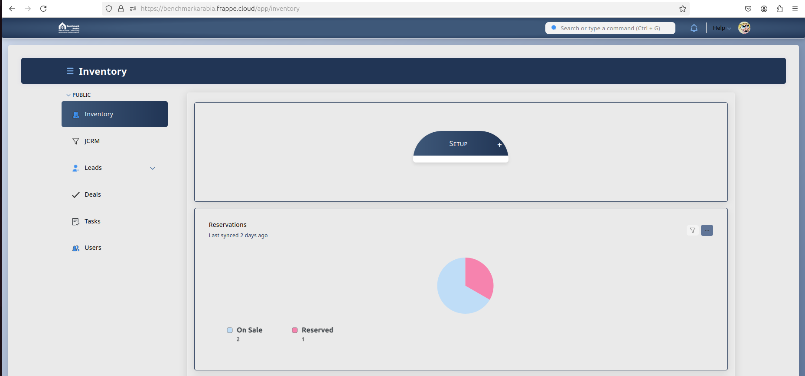
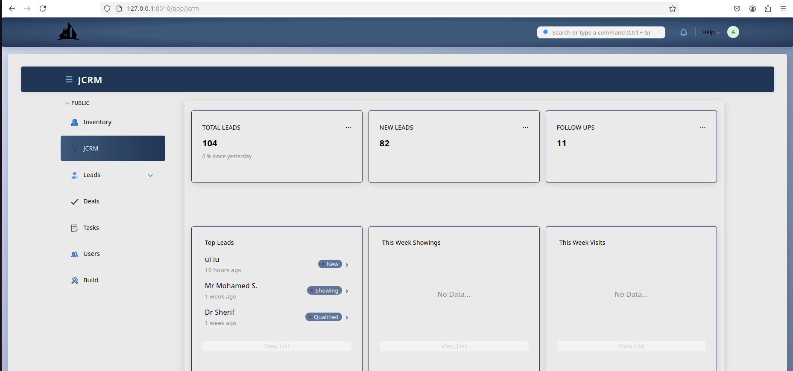
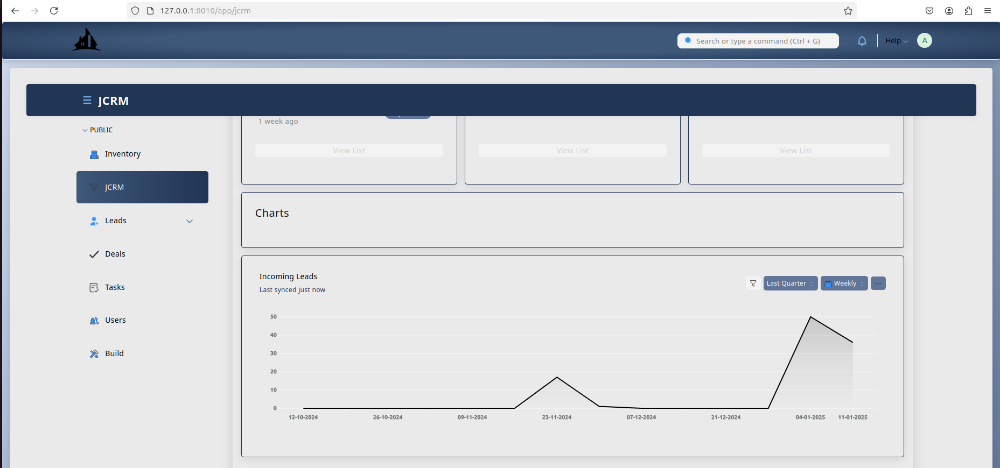

## JCRM Theme

JCRM Theme is a vibrant and refreshing custom theme designed for CRM Frappe-based System. It enhances the user interface with a visually appealing color scheme, providing a delightful user experience across all modules.







### Key Features

- **Custom Color Palette:** A unique color palette featuring shades of Blue, Grey, and White to create a lively and engaging interface.
- **Enhanced UI Components:** Custom styling for buttons, forms, tables, and other UI components to ensure a cohesive and attractive look.
- **Responsive Design:** Fully responsive design that adapts seamlessly to different screen sizes and devices.
- **User-Friendly Interface:** Intuitive and easy-to-navigate interface that improves user productivity and satisfaction.
- **Custom CSS and JavaScript:** Includes custom CSS and JavaScript files to extend and enhance the default Frappe framework styling.

### Installation

To install the JCRM Theme, follow these steps:

1. Clone the repository:
    ```bash
    bench get-app https://github.com/roaa-mamdouh/JCRM-Themes.git
    ```

2. Install the app on your site:
    ```bash
    bench --site [sitename] install-app JCRM-Themes
    ```